# docker-sparta-app-deployment

## Day 1:
### Install Docker Desktop
* After installing Docker, it says that I do not have the updated version of Windows Subsystem for Linux (WSL). I would need to run the command `wsl --update`.
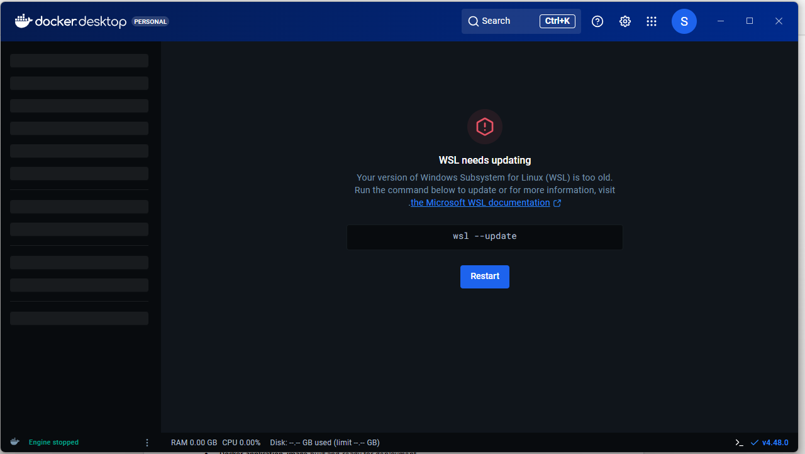
### Solution:
* I went to Windows Powershell (run as administrator) and installed wsl; `wsl --install`. Then went on to check if it's been installed properly by doing `wsl --list --online`. Then i checked the version to make sure it was the correct one: `wsl --version`.
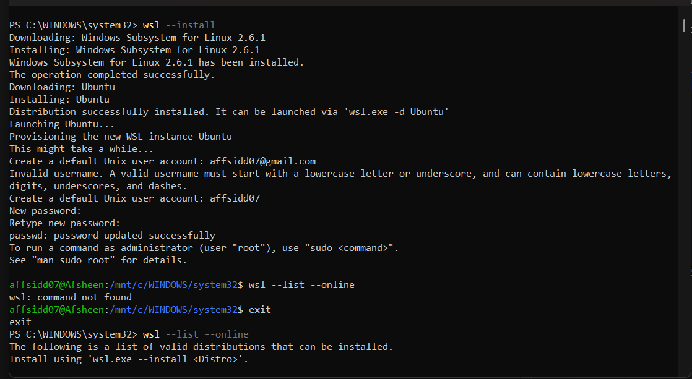
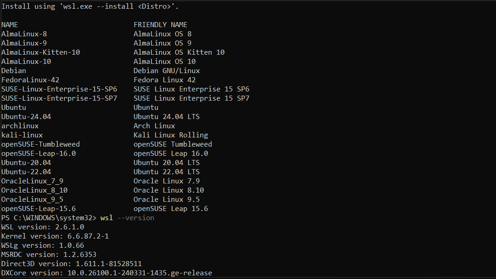
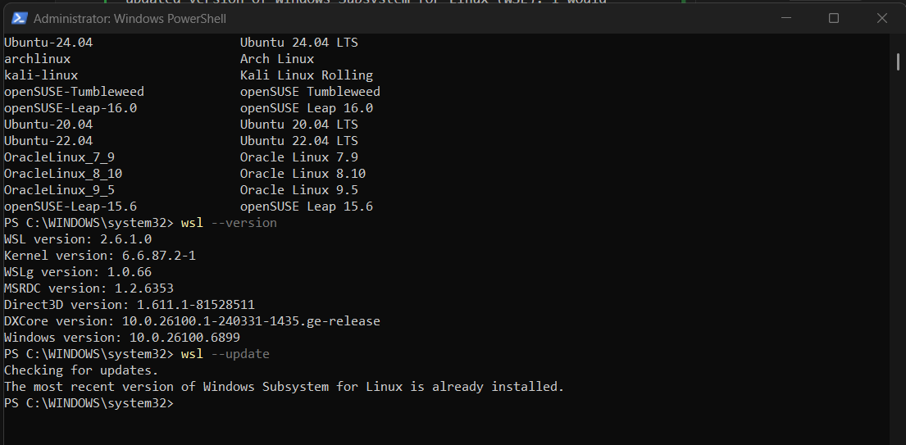

### Task 1: Research microservices, containers and Docker

## Differences between virtualisationand containerisation

### What is usually included in a container VS virtual machine?
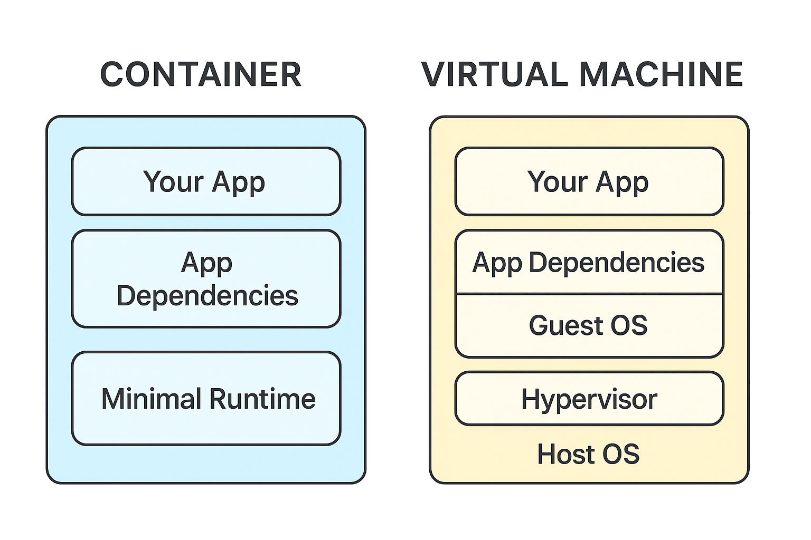
  * A container includes just the application and its dependencies.
  * A Virtual Machine includes the application and its dependencies but also the entire operating system.
  * A container is more quicker to startup due to its less storage size.
  * A Virtual Machine can take a few minutes since its a bit heavier.
  * A container is also extremely portable (same image runs anywhere with Docker).
  * A Virtual Machine is less portable as it depends on the OS image.

### Benefits of each, especially a virtual machine over the traditional architecture
* In the traditional architecture, each physical server would run only on one OS instance.
* This would mean that apps would run on the same OS which would cause conflict due to dependency issues.
* With the help of VM's, each VM would run its own OS, fully separated meaning that one app crash wouldn't affect others.
* With VM's, you could also run different OS types (Windows, Linux, etc.) on the same host.
* Containers would allow a fast startup in seconds rather than in minutes for VMs.
* Containers are ideal for microservices which means that they could deploy and scale individual components easily.  

## Microservices

### What are they?
* Microservices are a software architecture style where an application is divided into small, independent services - each responsible for a specific business function. 

### How are they made possible?
Microservices are amde possible through:
* Containerisation - tools like Docker isolate each service in its own lightweight environment.
* API communication - services talk via HTTP/REST or message queues (RabbitMQ/Kafta).
* DevOps & CI/CD pipelines - Kubernetes, AWS ECS, Azure AKS, or GCP GKE make orchestration easy.
* Indepenedent Databases - each service can have its own data store (SQL, NoSQL, etc).

### Benefits
* Scalability: Scale only the services that need more resources (e.g., payment service during sales).
* Resilience: If one service fails, others continue running.
* Faster Development: Teams can work independently on different services.
* Technology Freedom: Each microservice can use different languages or frameworks.
* Easier Maintenance: Smaller codebases are easier to understand, test, and deploy.
* Continuous Deployment: Push updates to individual services without taking down the whole app.

## Docker

### What is it?
Docker is a containerisation platform that allows you to:
* Package an application and all its dependencies into a portable unit called a container.
* Run that container consistently across different environments - developer machines, test servers, or production. 

### Alternatives to Docker
* Podman
* containerd
* CRI-O
* LXC/LXD
* rkt (Rocket)

### How Docker Works (Architecture)
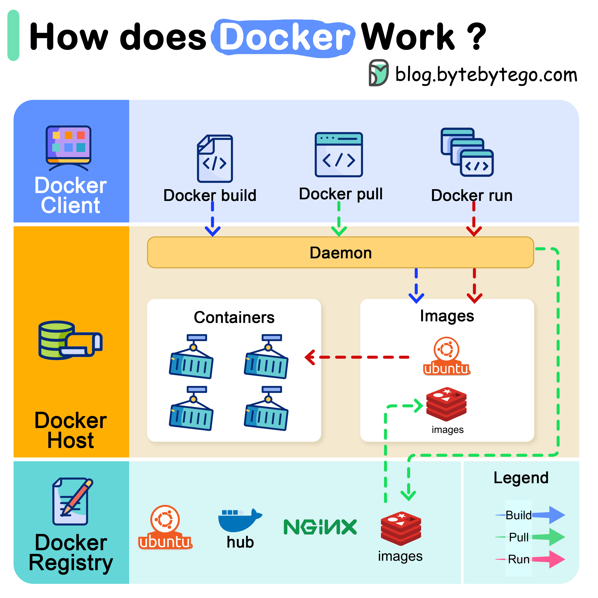

* Docker Client (CLI):
    * You type commands like docker build, docker run.
    * Communicates with the Docker daemon via REST API.
* Docker Daemon (dockerd):
    * Background service that builds, runs, and manages containers.
* Docker Images:
    * Read-only templates that define how to create containers (via Dockerfile).
* Docker Containers:
    * Running instances of images — isolated environments for your apps.
* Docker Hub (Registry):
    * Cloud repository for storing and sharing images.

## Success Story
* Netflix migrated from a monolithic architecture to Dockerized microservices.

* Before Docker:
  * Deployment was slow.
  * Different environments caused version conflicts.
  * Scaling required manual VM management.

* After Docker:
  * Services deployed as lightweight containers.
  * Consistent environments for all developers.
  * Rapid scaling to meet streaming demand spikes.
  * Integrated seamlessly with Kubernetes for orchestration.

* Netflix reported significantly faster rollouts and simplified management of hundreds of microservices.

## Task 1: Run and pull your first image
* Once I opened a GitBash terminal, I tried getting help from the docker command to see what commands I could next run:
  * `docker --version` - check if docker is intalled correctly.
  * `docker --help` - gives an overview of all commands we can run.
  * `docker images --help` - help on a specific subcommand.
  * `docker images` - to list all docker images already downloaded on my machine. Will be empty and show this output:
  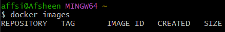
  * After running this command, there was no image that was created. This creates a new image named 'hello-world' when we run `docker run hello-world`.
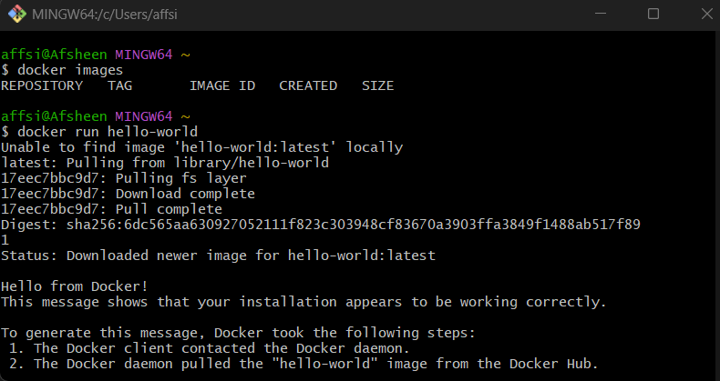 
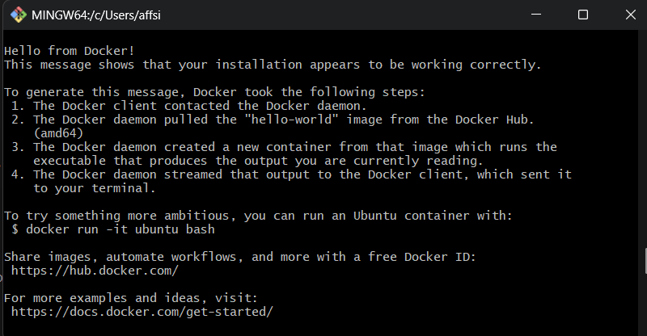
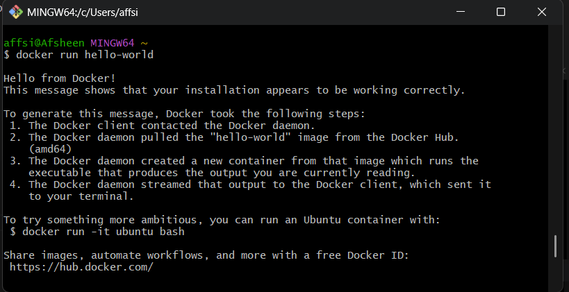
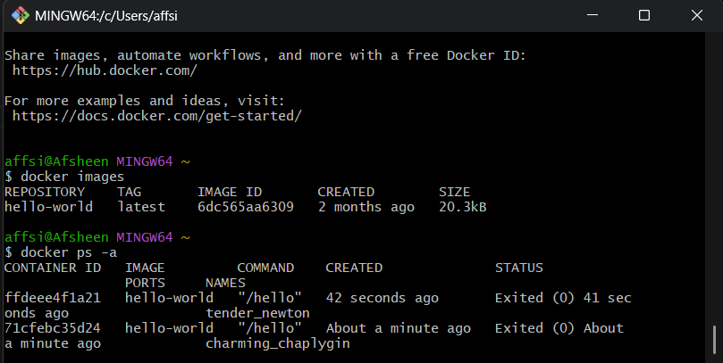

### What has happened:
* When we run the `docker run hello-world`, Docker checks if the 'hello-world' image exists locally.
* Since it does not, Docker pulls it from Docker Hub which is an online image registry.
* Docker then creates a container from that image and runs it. 
* The container prints a confirmation message saying "Hello from Docker! This message shows that your installation appears to be working correctly".
* The container stops after printing that message.
* When we run the `docker run hello-world` command, Docker finds the image locally, so it does not need to be pulled again.
* It creates a new container from the already-downloaded image.
* The ouptut will show the same "Hello from Docker!" message but nothing is downloaded.
* When we confirm the local image by running `docker images`, we see this output:
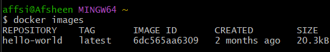

## Task 2: Run nginx web server in a Docker Container
*  After opening a new Github terminal and checking that Docker Desktop id running by doing `docker version`, I had to download the latest Nginx Image. I used Google for this along with `docker --help` which told me that the command is `docker pull nginx:latest`. This gave me an output: 
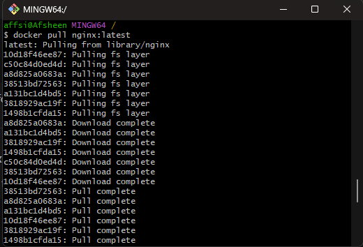
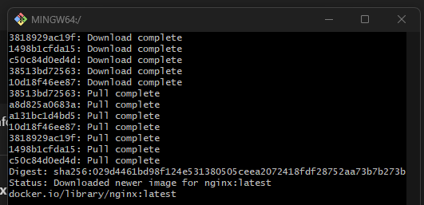
* We check if the image was downloaded by running `docker images`.
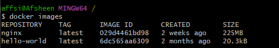
* Then we need to create a container from that image and expose it to the local machine by running `docker run -d -p 80:80 --name mynginx nginx` (got this from Stackoverflow)
  * -d -> run detached (in the background)
  * -p 80:80 -> map host 80 to container port 80
  * --name mynginx -> name of container
  * nginx -> image name to run
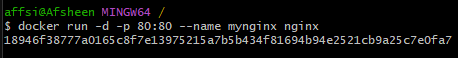
* Check if it is running: `docker ps`
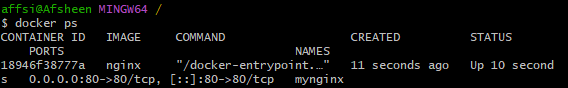
* Once I get the port and status, I went on `http://localhost` and checked for nginx's default webpage.
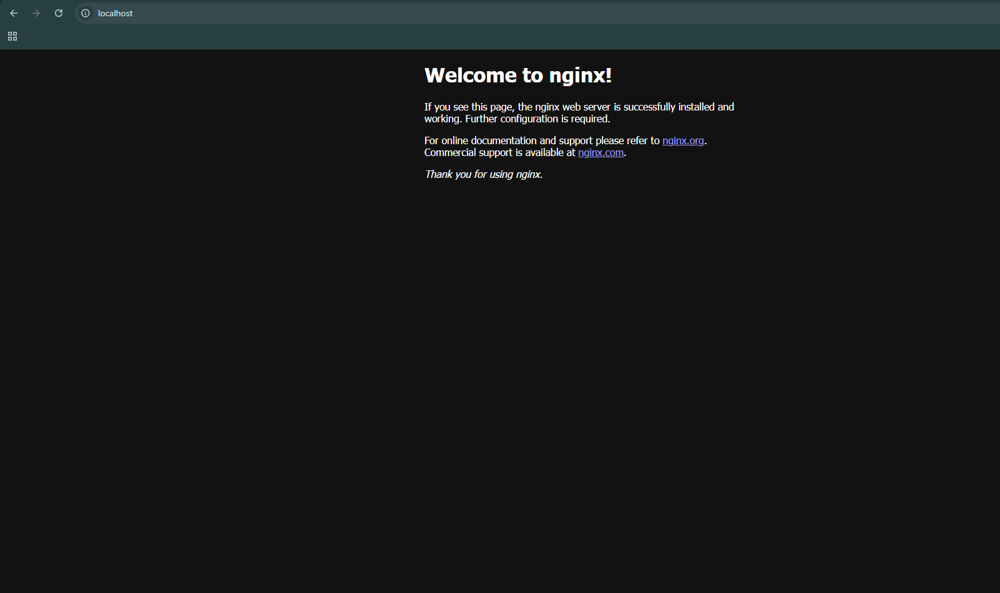
* When done, I stopped the container and made sure it was stopped: 
  * `docker stop mynginx`
  * `docker ps` 
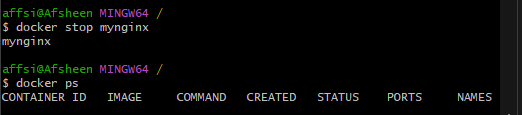

## Task 3: Remove a container
* After starting the nginx container again and checking if it's running, I tried removing it by doing `docker rm mynginx` but got an error:
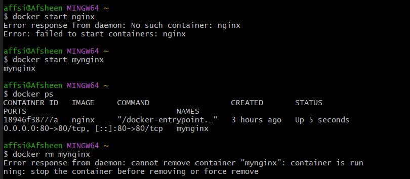
* This made me use force to removue it by doing `docker rm -f mynginx`. The -f flag meant that it stopped the container first and then removed it. 
* Then, I double checked it was successfully removed.
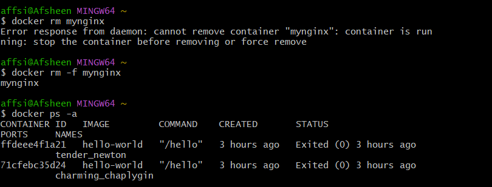

## Task 4: Modify our nginx default page in our running container
* Since I had removed the container previously, I created again and checked in the browser if it's running. 
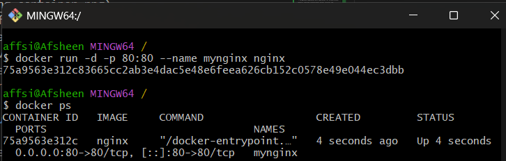
* After the default page was working, I needed to open an interactive shell inside the running container.
* When I ran `docker exec -it mynginx /bin/bash`, it gave me an error: `The input device is not a TTY`. This was becuase Git Bash on Windows doesn't natively handle interactive terminals. To fix this, I needed to define an alias with `winty`.
* To do this, I ran `alias docker='winty docker'` and tried the above `docker exec` line again but it gave me an error.

* I then went to GenAI and asked what other commands I could use.
* It told me to try `docker exec -it mynginx /bin/sh` but it gave me the same error as the picture above.
* 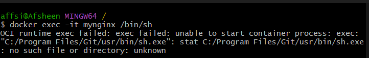
* I then asked GenAI for another line and it told me to try `docker exec -it mynginx sh`. This made me go inside the Nginx container as I had `#` as the new line. 
[inside-nginx-container](inside-nginx-container.png)
* After I got in, I ran an update/upgrade command to get the container's packages up-to-date: `apt update && apt upgrade -y`.
* I then tried using sudo by doing `sudo ls` but I got an error indicating that it hasn't been installed which is why I went on installing it first with the command `apt install sudo -y`:
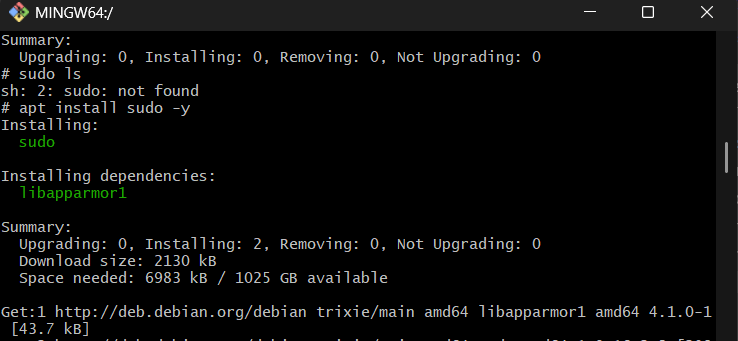
* After the installation was complete, I did a `pwd` to check where I was and then navigated to where Nginx's server files are.
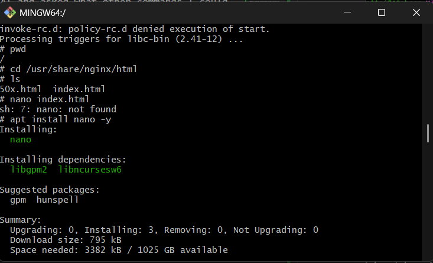
* After that, I did an `ls` to see the `index.html` file and tried to `nano` into it. However, `nano` was not installed and I needed to install it first before being able to edit the file. 
* After the installation was complete, I edited the file where I replaced "Welcome to nginx" to "Welcome to the Tech511 Dreamteam!".
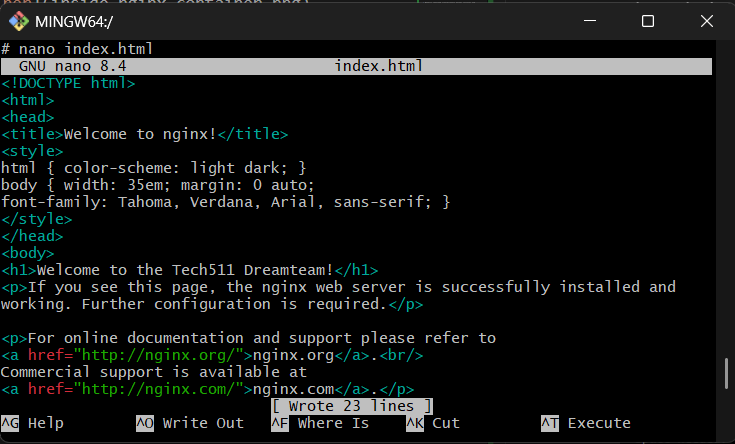
* This was the output on the browser:
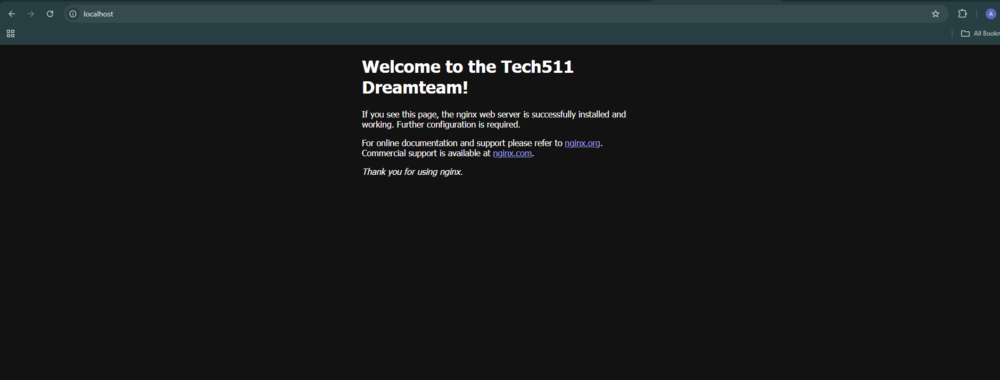

## Task 5: Run a different container on different port
* After checking if the container is still running, after running `docker ps`, I had this output:
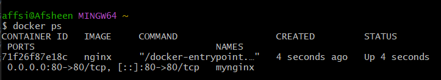
* I tried running another container using the image `daraymonsta/nginx-257:dreamteam` by running this command: 
`docker run -d -p 80:80 --name dreamteam daraymonsta/nginx-257:dreamteam`. 
* This gave me the following error: 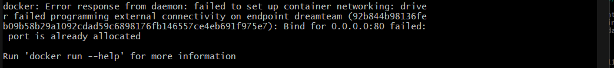

### What has happened:
* This error was because only one process can "own" a port at a time and I was trying to get two containers on the same host port (80).
* Since my first container (mynginx) already is running on port 80 (host) -> port 80 (container), I can't get the second one bound to that port too since Docker can't do it as it causes a port binding conflict.

* After the error, it's most likely that Docker created a stopped container entry with that name, so I went ahead and removed it first. 
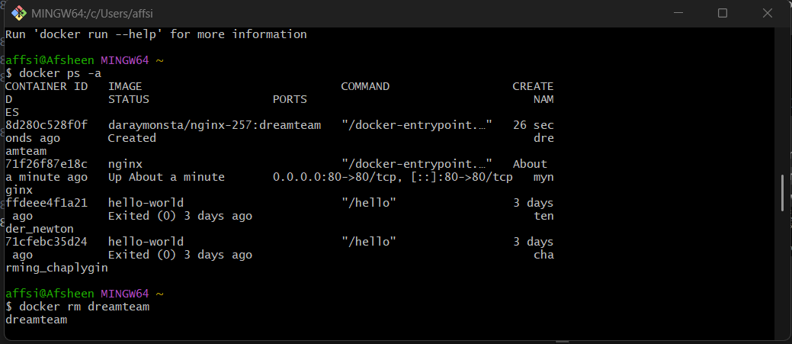
* I then went on to running the same container with a different port (90) by using `docker run -d -p 90:80 --name dreamteam daraymonsta/nginx-257:dreamteam`
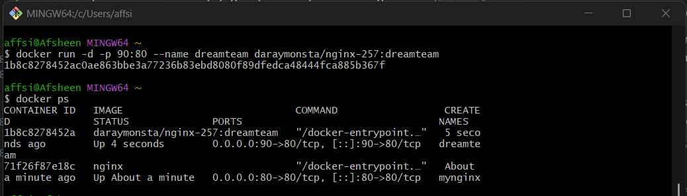
* I then did a `docker ps` to check if it was running and then went on to the browser to check it was working.
* http:localhost -> original nginx container
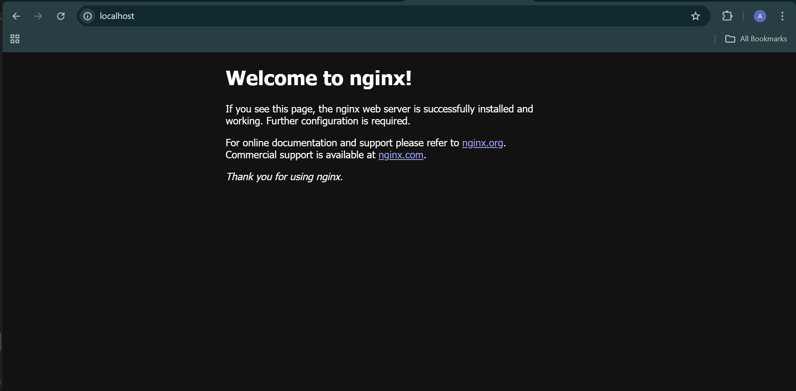
http:localhost:90 -> the new daraymonsta/nginx-257':dreamteam container
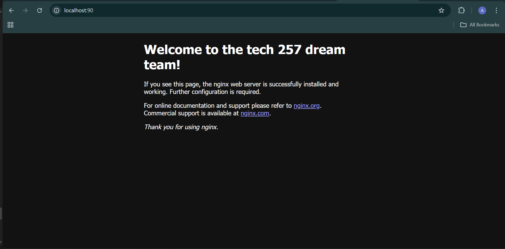

## Task 6: Push host-custom-static-webpage container image to Docker hub
* To do this task, I had to run the command `docker commit mynginx <mydockerhubusername>/host-custom-static-webpage:latest`. I found this command while searching on Google.
* This creates a new image on my local machine that includes nginx, a modified index.html and all current container changes.
* I confirmed this by doing `docker images`.
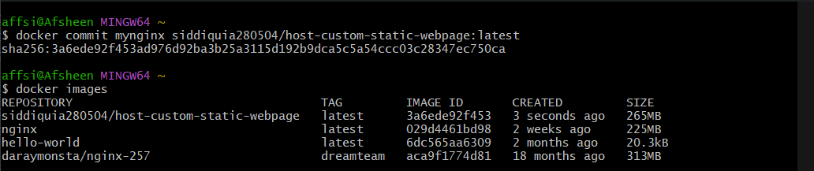
* After that, I logged into docker hub by running `docker login` and once it told me "Login Succeeded", I pushed in the image into my Docker hub account by running `docker push siddiquia280504/host-custom-static-webpage:latest`.
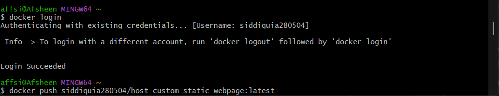
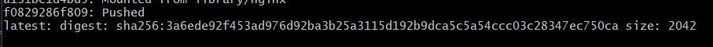
* After the upload was complete, I logged into Docker hub and went to my repository. I then saw the image I just uploaded.
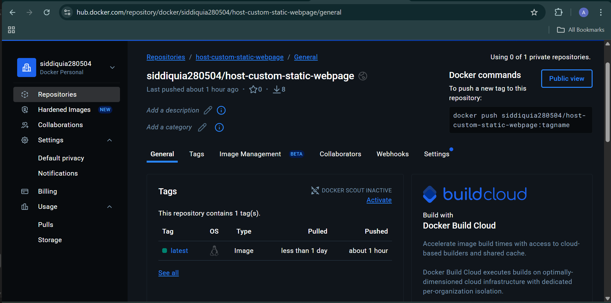
* To confirm it worked properly, I needed to use the remote image from the Docker hub. This meant that I needed to remove the old container: `docker stop mynginx` and `docker rm mynginx`.
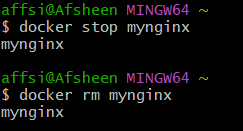
* I then ran the image from the Docker hub: `docker run -d -p 80:80 --name mynginx siddiquia280504/host-custom-static-webpage:latest`
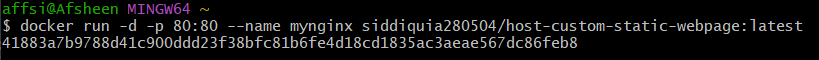
* I then went to http://localhost and saw the following output:
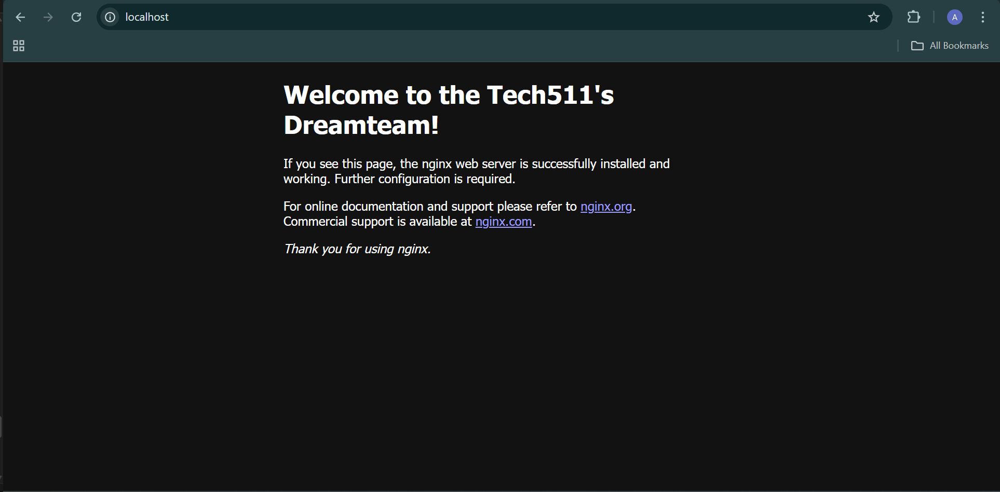

## Task 7: Automate docker image creation using a Dockerfile
* After creating a new file `mkdir tech511-mod-nginx-dockerfile` and `cd tech511-mod-nginx-dockerfile`, I created a custom HTML file and edited it accordingly to what text I wanted (`nano index.html`).
* After that I did a `nano Dockerfile` and added the official nginx base image.
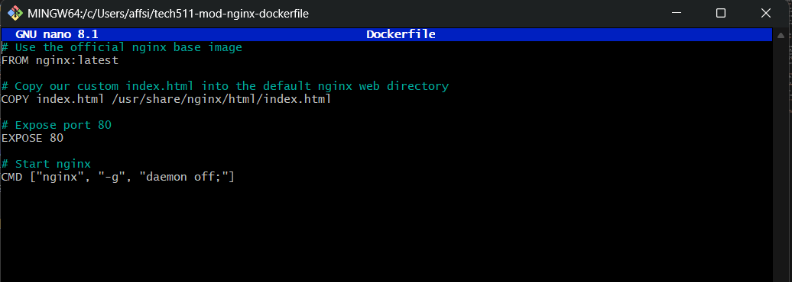
* I then built my custom image `docker build -t tech511-nginx-auto:v2 .`:
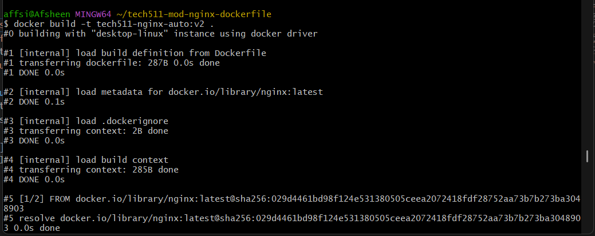
* -t tags the image (name: tech511-nginx-auto, version: v2)
* . means the Dockerfile is in the current directory
* I then ran the newly built image: `docker run -d -p 93:80 --name tech511-auto tech511-nginx-auto:v2.
* I then went to http://localhost:93 and saw the following output:
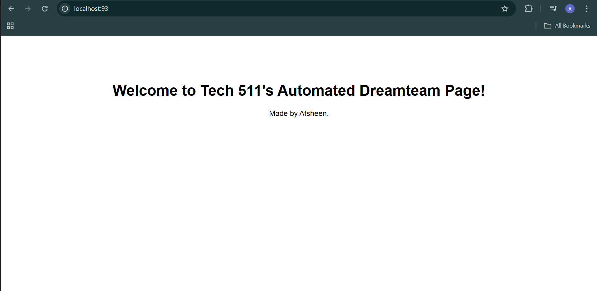
* I then pushed the image to Docker hub by doing `docker tag tech511-nginx-auto:v2 siddiquia280504/tech511-nginx-auto:v2
* I logged in to docker `docker login` and then pushed `docker push siddiquia280504/tech511-nginx-auto:v1`.
* I verified if the image has been pushed in my repositories in Docker hub:
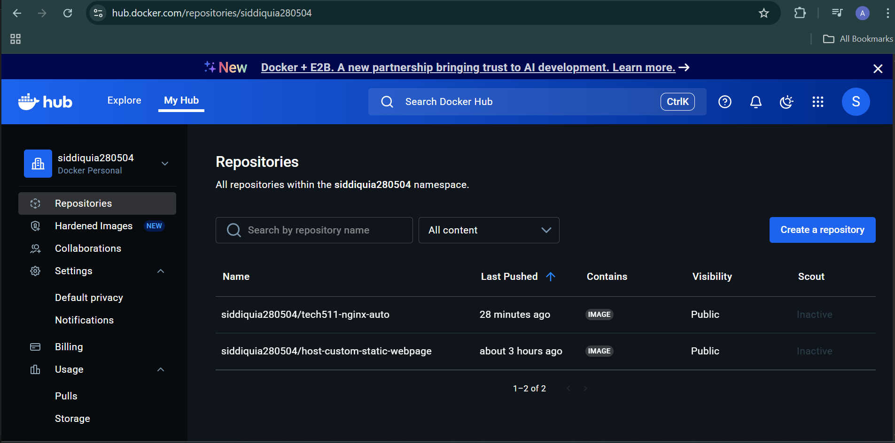
* I then cleaned up the local image and container with the following commands:
  * docker stop tech511-auto
  * docker rm tech511-auto
  * docker rmi tech511-nginx-auto:v2
  * docker rmi siddiquia280504/tech511-nginx-auto:v2
* Finally, I forced Docker to pull from Docker hub and run it again: `docker run -d -p 93:80 --name tech511-auto siddiquia280504/tech511-nginx-auto:v2`.
* This will make sure Docker downloads my image from Docker hub and starts the container.
* The custom index.html is now embedded into an automated nginx image.
* Anyone can know pull and run it from my Docker hub repo.

## Day 2:
### Task 1: Run Sparta test app in a container
* Firstly, I started by creating a directory in my GitHub folder `mkdir docker-sparta-test`.
* I then copied the app folder from one of my previous repositories manually and pasted it into this new folder I just created.
* I then cd'd into the new folder and created a Dockerfile and added the following content:
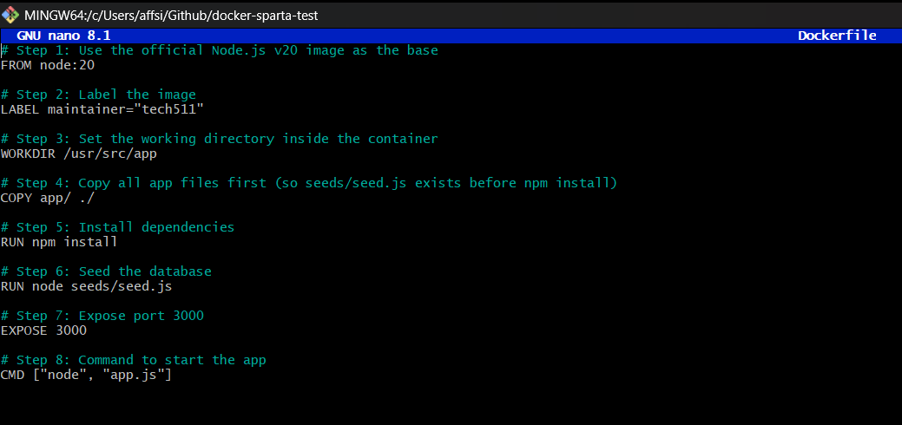.
* After that, I built the image by running `docker build -t tech511-sparta-app:v1`. This will pull the Node.js v20 base image (if not already available), copy the app files, install dependencies and build the container image.
* I then ran the container by running `docker run -d -p 3000:3000 --name sparta-app tech511-sparta-app:v1` and went to `http://localhost:3000` to see the output.
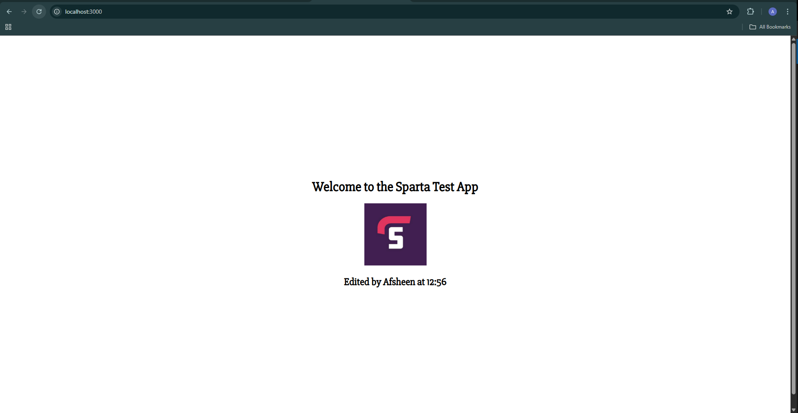
* After this, I had to push the image to docker hub so i made sure to login by running `docker login`. After login was successful, I tagged the image: `docker tag tech511-sparta-app:v1 siddiquia280504/tech511-sparta-app:v1` and pushed it: `docker push siddiquia280504/tech511-sparta-app:v1`
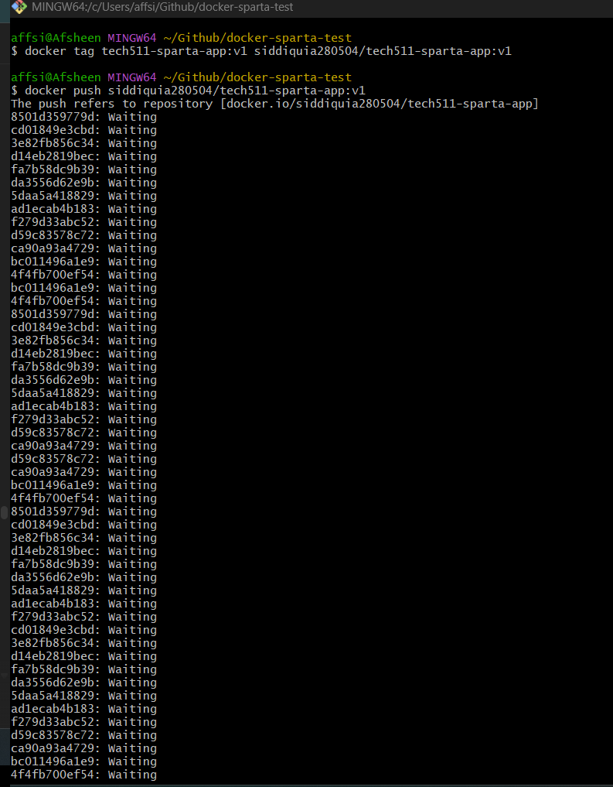
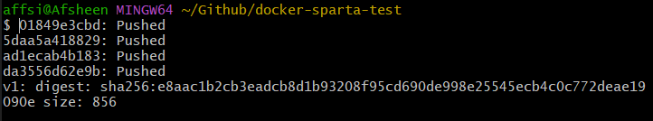
* I then removed the old container by running `docker rm -f sparta-app` and then reran the image: `docker run -d -p 3000:3000 --name sparta-app tech511-sparta-app:v1`.
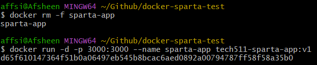
* This removal and rerun was to see if after we pushed the image into the repository on dockerhub, if it still works. We would need to remove it since we already have a container with that name and would need to delete it if we were to use the same name. 

### Task 2: Research Docker Compose
### Why use it?
* Docker Compose is a tool used to define and manage multi-container applications. We can specify every command (containers, networks, volumes, etc.) in one YAML file and start it all at once instead of manually running many `docker run` commands.
* We need to use Docker Compose when we have multiple containers (e.g., backend + database + frontend) where Compose can run and connect them all automatically.
* When we repeat long `docker run` commands, we can use Compose to store all config in one YAML file.

### How to use it?
* We need to first install Docker Compose but can already be installed when installing Docker Desktop so would need to just check the version using `docker compass version`.
* Otherwise install it by doing `sudo apt install docker-compose-plugin`. 
* Next, create a docker-compose.yaml file with the following content:
version: "3"
services:
  app:
    image: tech511-sparta-app:v1
    ports:
      - "3000:3000"
    depends_on:
      - mongo

  mongo:
    image: mongo
    ports:
      - "27017:27017"
    volumes:
      - mongo-data:/data/db

volumes:
  mongo-data:

* We store this file in the Docker Compose File.
* We then need to build and start app: `docker compose up --build`
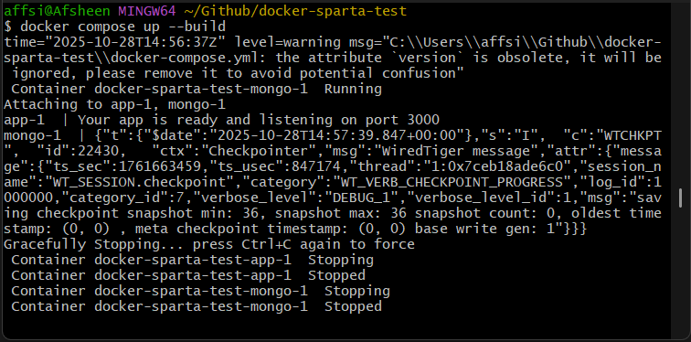
* Run in background: `docker compose up -d`
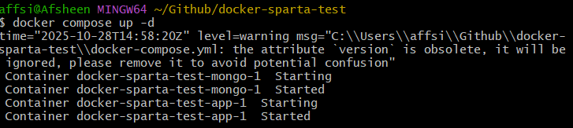
* Check running containers: `docker compose ps`
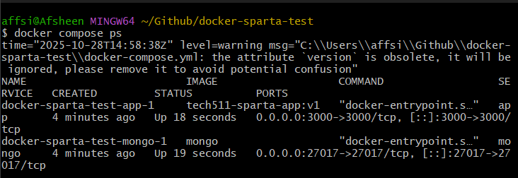
* Follow logs: `docker compose logs -f`
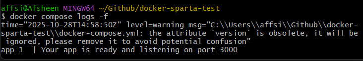
* Stop the app: `docker compose down` 
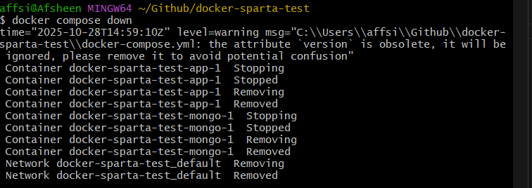
* View images: `docker compose images`
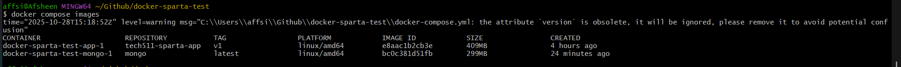

* Running the app without detached mode using `docker compose up` keeps it in the foreground, showing live logs in the terminal until stoped with `Ctrl + C`.
Running it in detached mode using `docker compose up -d` runs the containers in the background, freeing the terminal while being able to view logs with `docker compose logs -f`.

## Task 3: Use Docker Compose to run app and database containers
* After checking if I have the Node app image I need on Docker hub (`siddiquia280504/tech511-sparta-app:v1`), I created a docker-compose file which had the reverse proxy, image name port and the environmental variable set in:
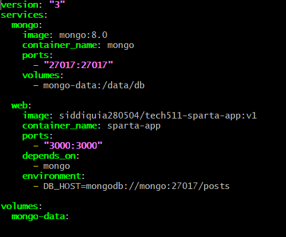
* After that I tried running both the containers in the foreground using `docker compose up --build` but found it hard to seed the database from the same terminal because as I was exiting out of the command, I was also stopping the container which was stopping the app from running. Hence I ran the container in the background with `docker compose up -d` after cd'ing into the `/app` folder.
* I then went to http://localhost:3000/posts to see if mongodb has been connected and the /posts page was empty. This was the case which meant it worked and I moved on to my next step.
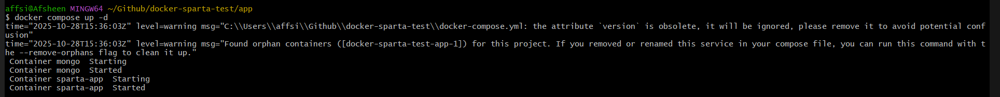
* After this worked, I tried to enter the container by running `winpty docker exec -it sparta-app bash`.
* Once I was in, I ran `node seeds/seed.js` to seed the database. I then went to http://localhost:3000/posts again and saw that the database had been seeded.
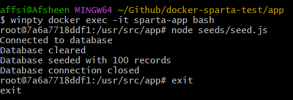
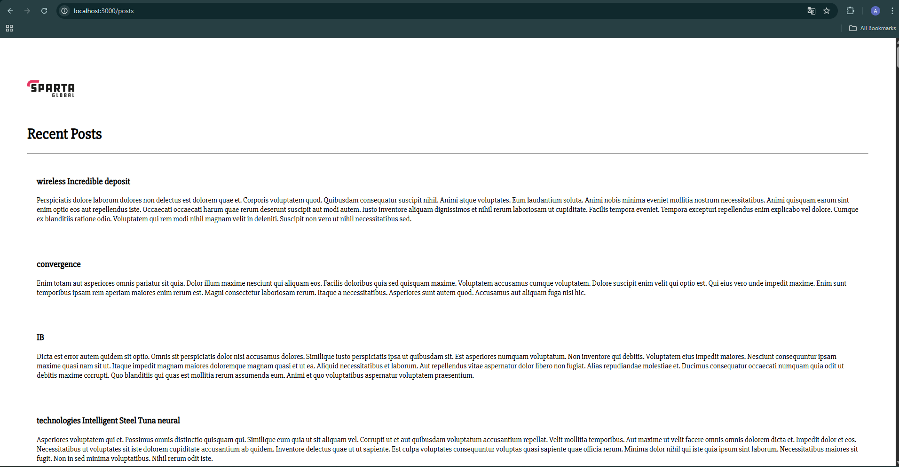